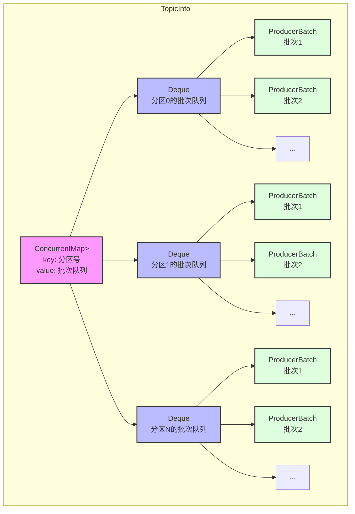

# TopicInfo中batches数据结构

```mermaid
graph TD
    subgraph TopicInfo
        A["ConcurrentMap<Integer, Deque<ProducerBatch>>
key: 分区号
value: 批次队列"] --> B1["Deque<ProducerBatch>
分区0的批次队列"];
        A --> B2["Deque<ProducerBatch>
分区1的批次队列"];
        A --> B3["Deque<ProducerBatch>
分区N的批次队列"];
        
        B1 --> C1["ProducerBatch
批次1"];
        B1 --> C2["ProducerBatch
批次2"];
        B1 --> C3["..."];
        
        B2 --> D1["ProducerBatch
批次1"];
        B2 --> D2["ProducerBatch
批次2"];
        B2 --> D3["..."];
        
        B3 --> E1["ProducerBatch
批次1"];
        B3 --> E2["ProducerBatch
批次2"];
        B3 --> E3["..."];
    end

    style A fill:#f9f,stroke:#333,stroke-width:2px
    style B1 fill:#bbf,stroke:#333,stroke-width:2px
    style B2 fill:#bbf,stroke:#333,stroke-width:2px
    style B3 fill:#bbf,stroke:#333,stroke-width:2px
    style C1 fill:#dfd,stroke:#333,stroke-width:2px
    style C2 fill:#dfd,stroke:#333,stroke-width:2px
    style D1 fill:#dfd,stroke:#333,stroke-width:2px
    style D2 fill:#dfd,stroke:#333,stroke-width:2px
    style E1 fill:#dfd,stroke:#333,stroke-width:2px
    style E2 fill:#dfd,stroke:#333,stroke-width:2px
```

图中展示了TopicInfo类中batches的数据结构：

1. 最外层是ConcurrentMap，键为分区号（Integer），值为该分区的批次队列
2. 每个分区都有一个Deque队列，用于存储该分区的ProducerBatch
3. 每个队列中包含多个ProducerBatch，这些批次按照先进先出的顺序管理